# Introduction
## The main idea for this project was that each user can maintain his diet diary so as to analyze his/her diet. On the main page via an API all the food items that are present on the company's website will be displayed as shown below:

## Logging In
  

On clicking the “Admin Login” button, admin_page() function is called and it renders the admin_login.html file; redirects to Admin Login page.

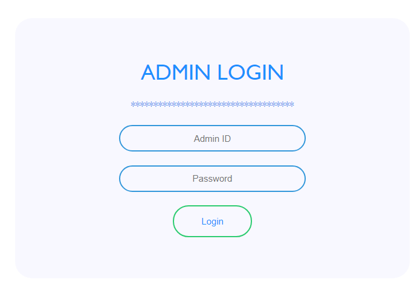  

On clicking the “Login” button, admin_login() function is called. If the Admin Id or Password is wrong, an error message is shown: “Invalid Admin or Password”; if the data is correct, it renders the fm_table.html file.

---
## Data Manipulation
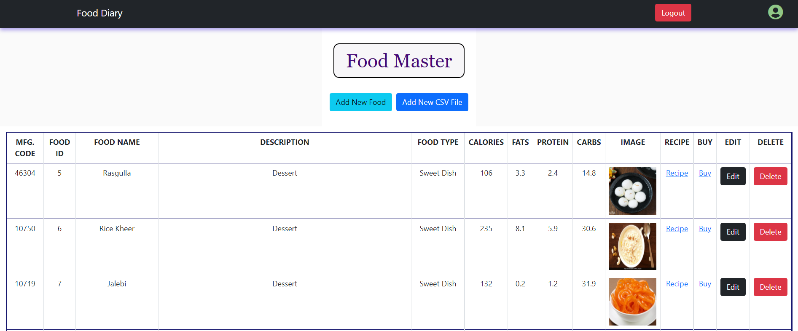  

After successful login to admin page, the food master table appears which contains data fetched from MySQL central database.

#### Adding
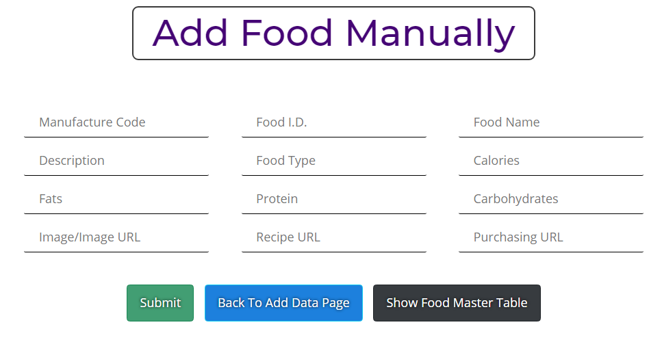  

When “Add New Food” is clicked on Food Master Table, this webpage is shown. Several input fields are shown.  

#### Batch Upload
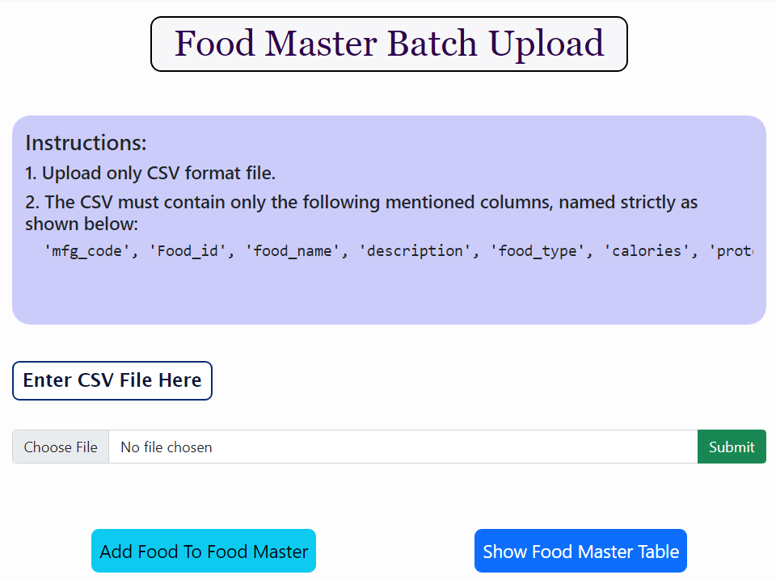  

When “Add New CSV File” is clicked on Food Master Table, this webpage is shown. Several input fields are shown.

#### Updating
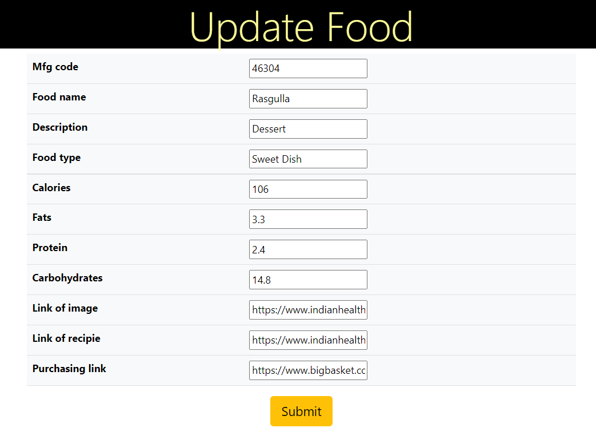  

When “Edit” is clicked on Food Master Table, this webpage is shown by rendering update_form.html. Several input fields are shown.
All the fields which are allowed to modify can be modified from here.

---
## Analysis
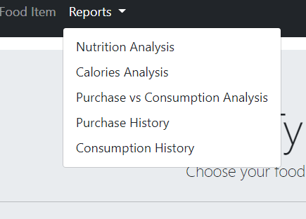  

Redirects to the User Food Log Charts.
The webpage has date inputs which shows calories consumption from dates recorded in database.

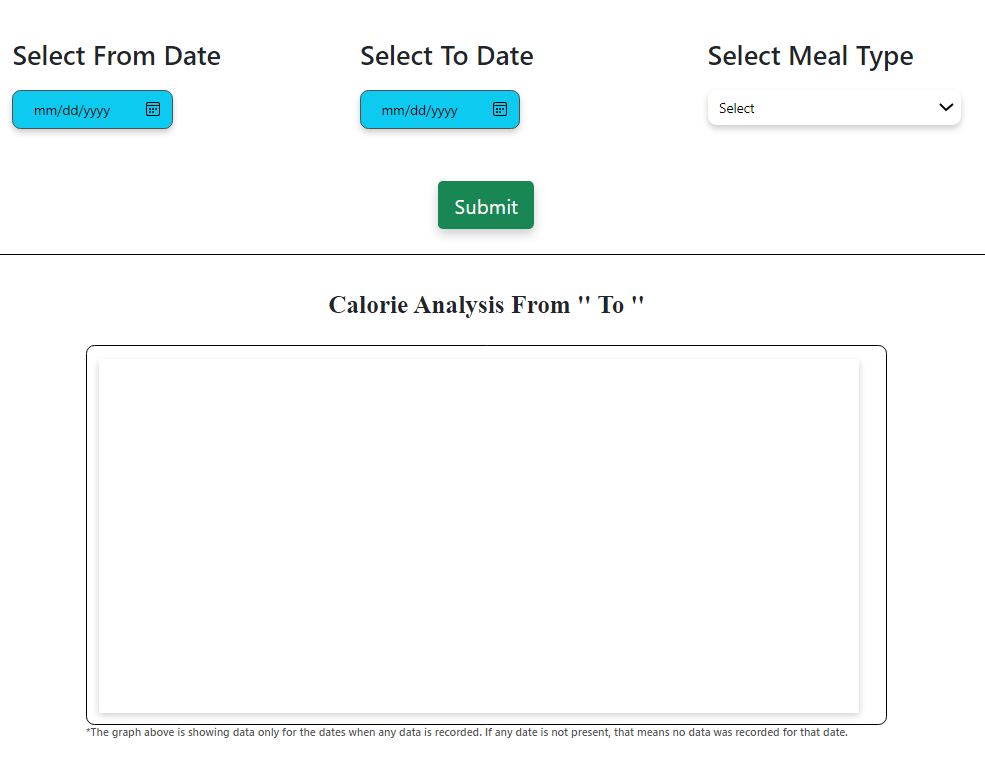
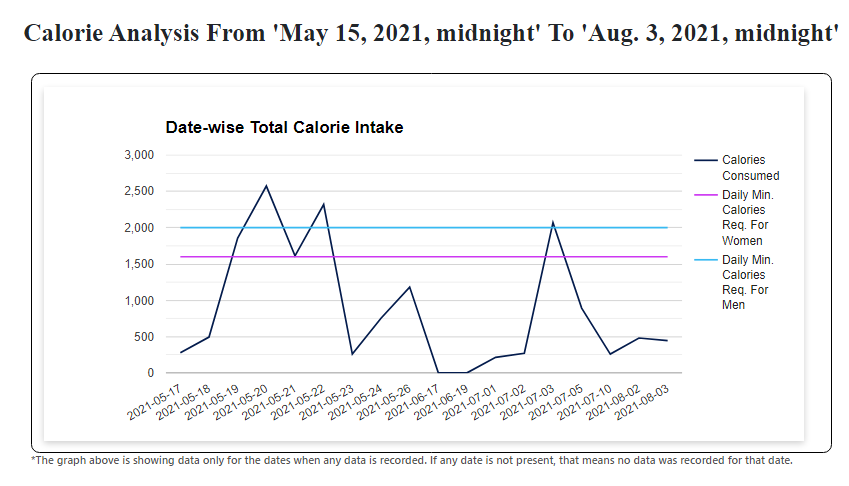  
_Interval Anlaysis_  

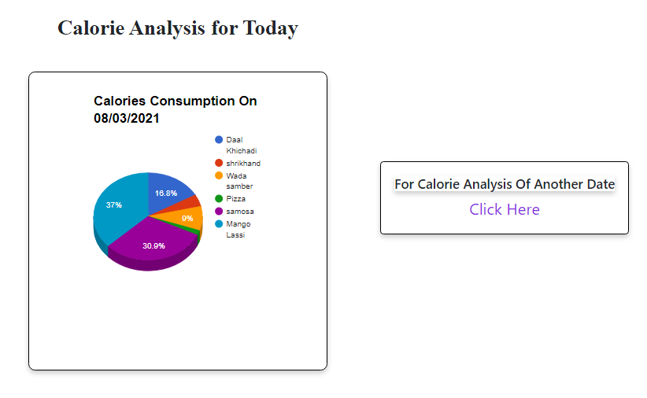  
_Daily Analysis_  

#### Datewise

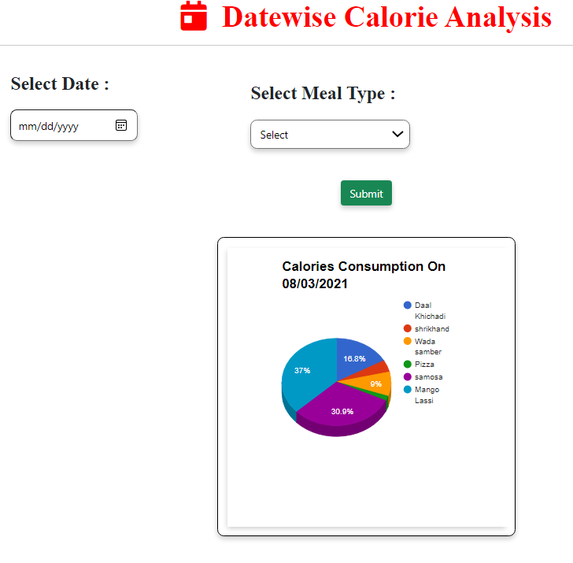  

Userfoodlogchart() accepts input from “Select From Date”, “Select To Date” and “Select Meal Type”; when “Submit” button is pressed, a line graph is shown representing the calories consumption between the selected date range and selected meal type. Comparison with average calorie consumption for men and women is also shown.

---
## Comparing
#### Consumption
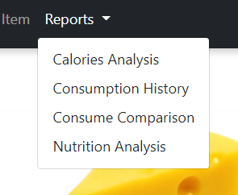  
_Accessing_  
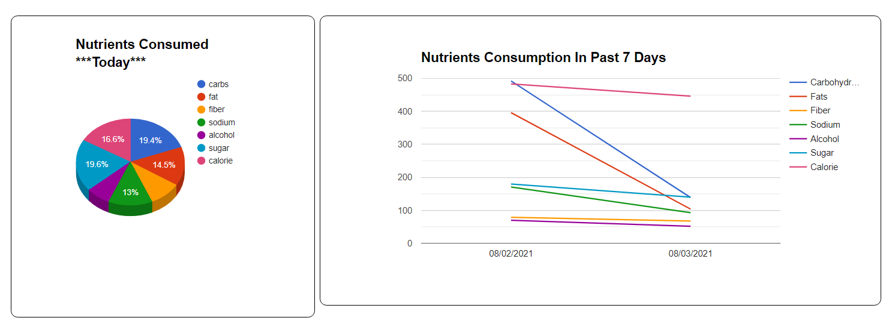  
_Charts_  

Redirects to the Consume Comparison page.
This page shows 2 analysis graphs. First graph is a pie-chart which shows distribution of quantities of nutrients consumed in present day. Second graph is a line chart which shows various line graphs.

#### Purchase
  
_Accessing_  
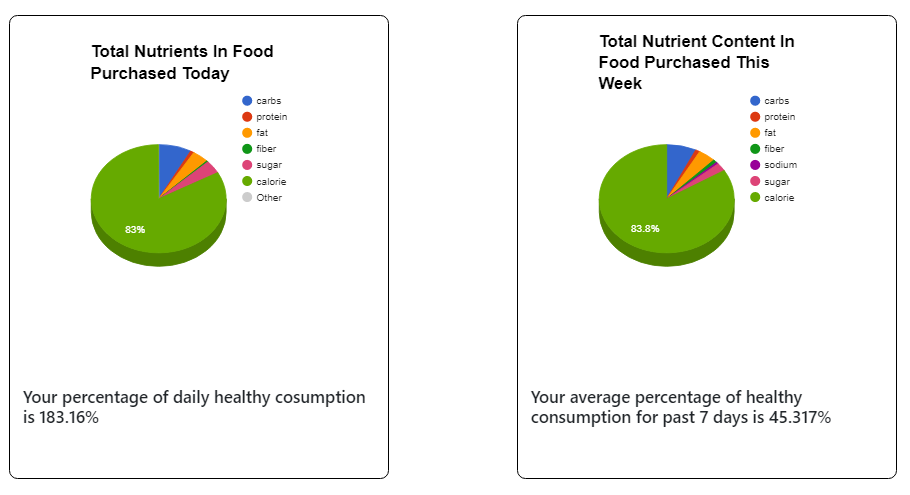  
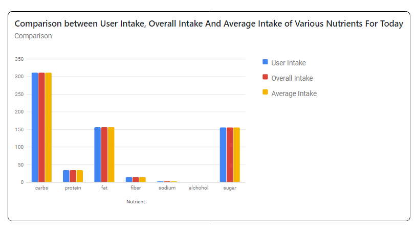  
_Charts_  

When Purchase Comparison is clicked, it calls the purchaseComparison() function which renders the purchaseComparison.html file and redirects to Purchase Comparison page. This page has 3 graphs:
1. Pie-chart that shows nutrient wise distribution of food items purchased today.
2. Pie-chart that shows nutrient based distribution of food items purchased in last 7 recorded days.
3. A bar graph that shows comparison b/w User Intake, Overall Intake and Average Intake of nutrients for that particular day. 
---
## Pancare
#### Adding manually
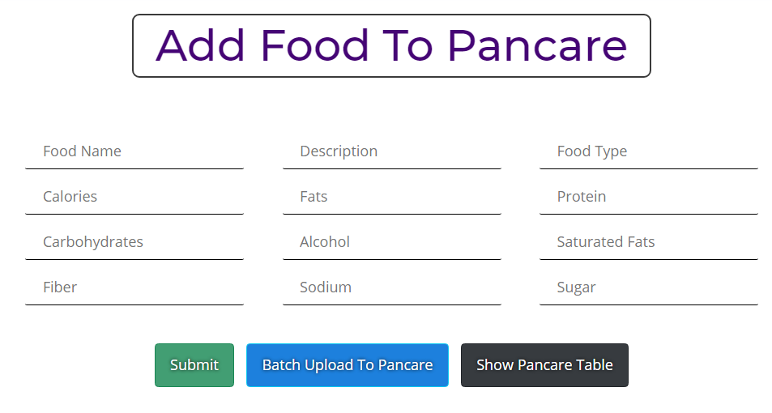  

On filling the above fields. And clicking the Submit button, function Adds individual food to Pan-care

#### Batch upload
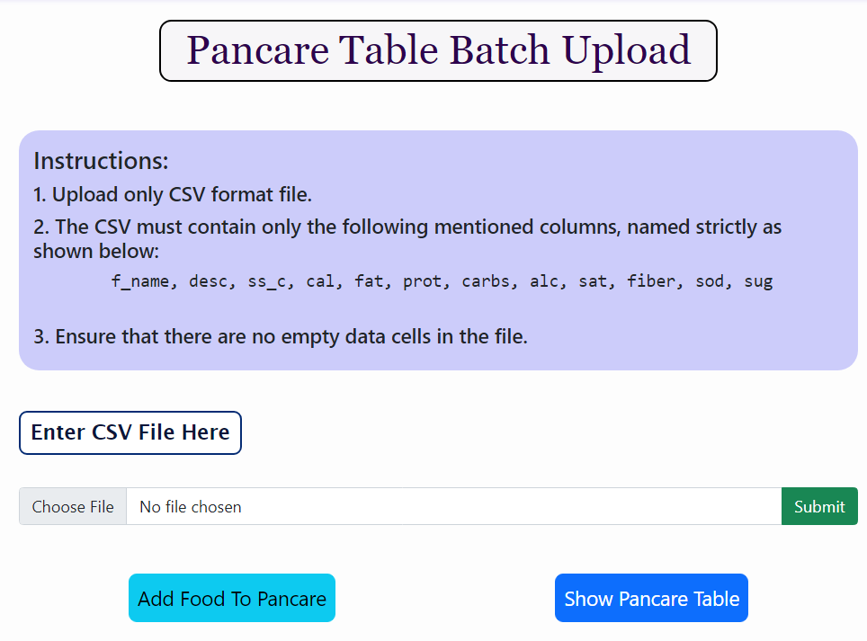  

On clicking the Submit button, function batch uploads food to Pan-care

---
## Purchases
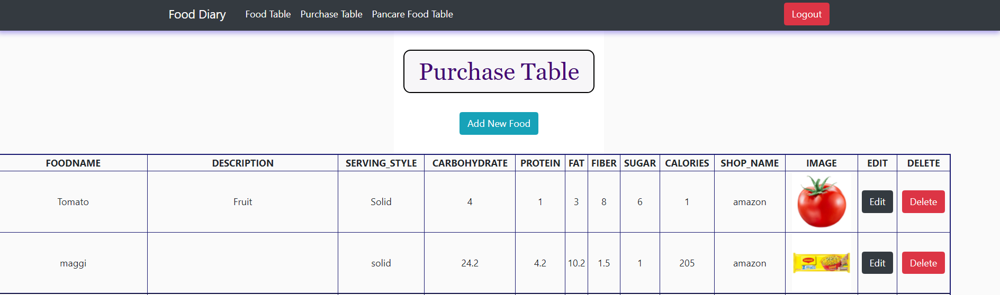  
_Purchases Table_  

#### Adding
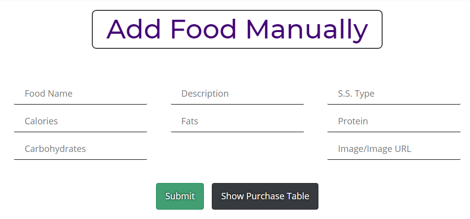  
Redirects to a form to add food to purchase table.  
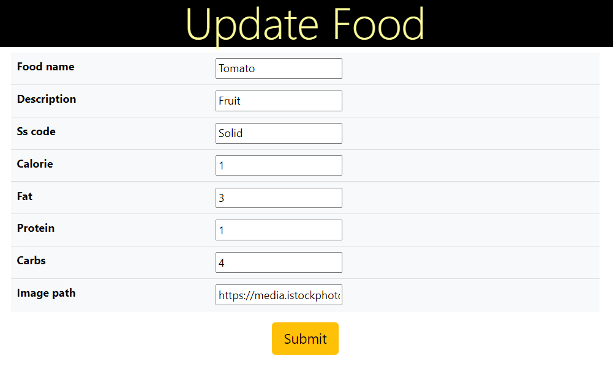  
Redirects to a form to update food items in purchase table,
